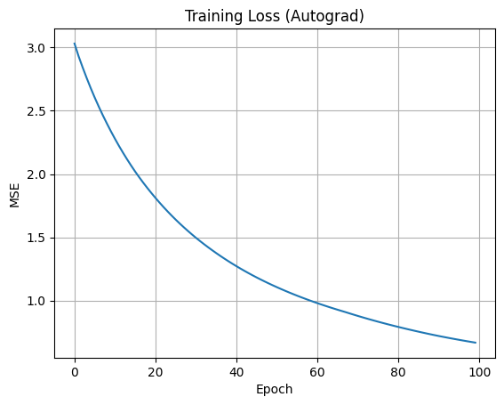
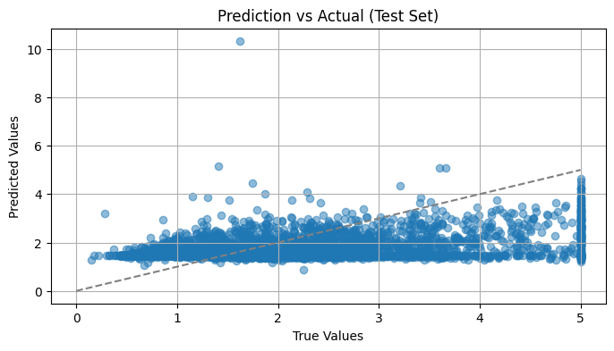

# 🧠 Real Data Regression with PyTorch Autograd

This project trains a small feedforward neural network to predict **California house prices** using **PyTorch autograd** and `nn.Module`. It builds upon my earlier projects where I implemented everything manually, and now transitions to using PyTorch's built-in features.

---

## 🔧 Model Architecture

- **Input layer:** 8 features (e.g., income, population, rooms)
- **Hidden layer:** 3 neurons with ReLU activation
- **Output layer:** 1 neuron for house price regression

---

## 🔁 Training Details

- Framework: PyTorch
- Loss function: Mean Squared Error (`nn.MSELoss`)
- Optimizer: Stochastic Gradient Descent (`torch.optim.SGD`)
- Dataset: `fetch_california_housing()` from sklearn
- Batch size: 32
- Epochs: 100

---

## ✅ What I Learned

- How to build a model using `nn.Module`
- What `__init__()` and `forward()` really do
- How `.backward()` computes gradients automatically
- How `optimizer.step()` updates weights
- The importance of `model.eval()` and `torch.no_grad()` during testing

---

## 📈 Training Loss

---

## 📊 Test Predictions vs Actual Values

This scatter plot compares the predicted prices against the actual prices on the test set.

---

## 🔮 Sample Predictions

